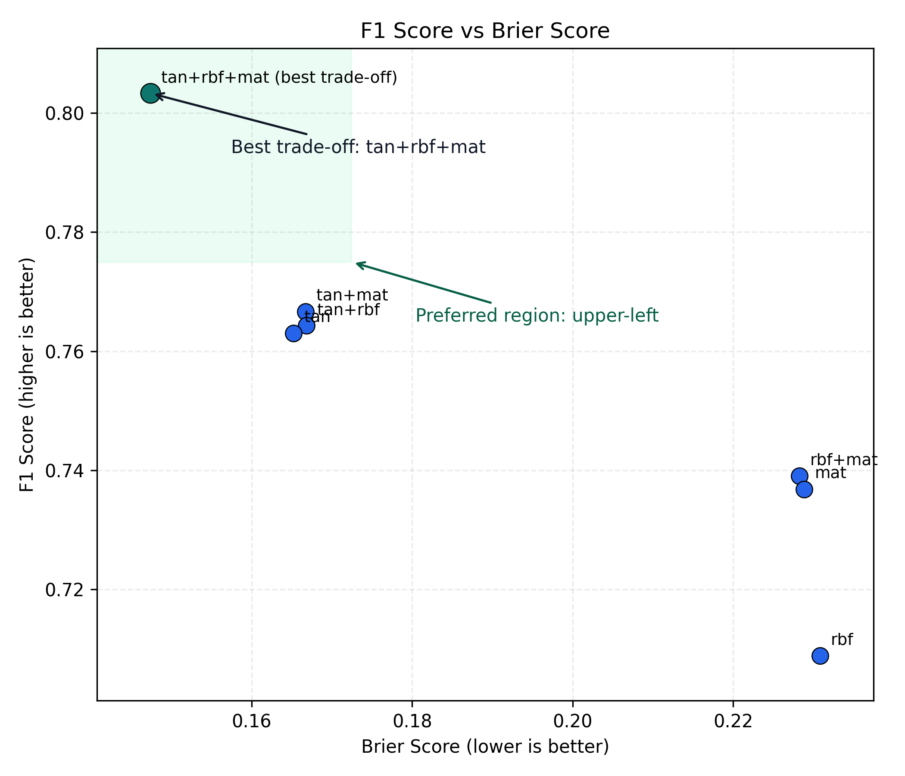
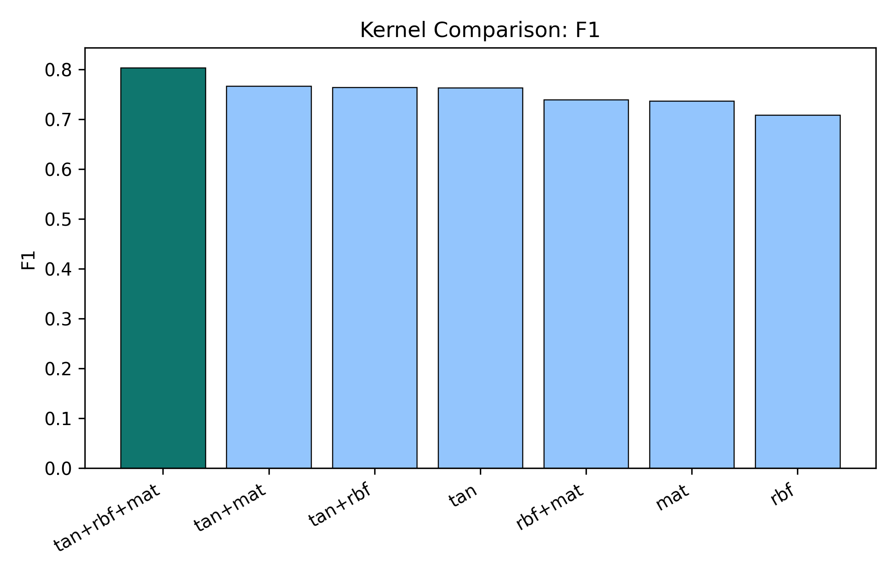
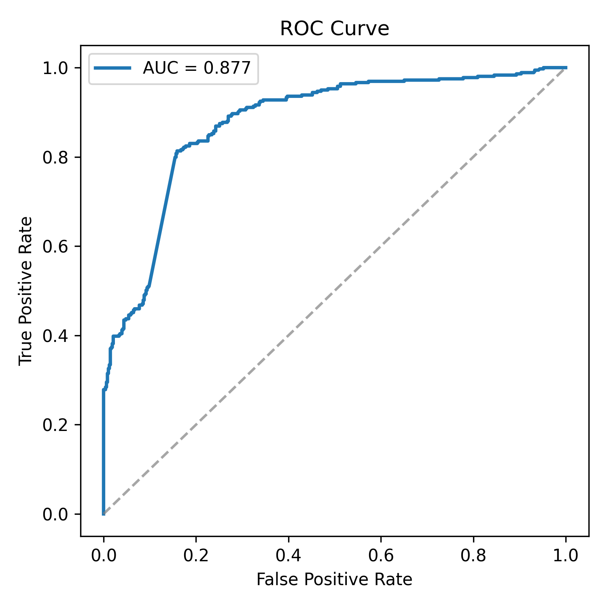

# Composite Gaussian Process Kernel for Molecular Toxicity Prediction

This repository contains the final `tan + rbf + mat` Gaussian process experiment used for molecular toxicity prediction.

The final model combines:

- Tanimoto similarity over Morgan fingerprints
- RBF kernel over PCA-compressed RDKit 2D descriptors
- Matern kernel over the same descriptor embedding

## Repository Structure

```text
.
|-- data/                  # Train/test CSV files
|-- notebooks/             # Jupyter notebooks
|-- src/
|   |-- kernels/           # Composite kernel implementations
|   |-- models/            # Gaussian process classifiers
|   |-- utils/             # Utility functions
|   `-- evaluation/        # Metrics and calibration analysis
|-- experiments/           # Runnable experiment scripts
|-- results/               # Saved outputs and figures
|-- img/                   # README figures
|-- requirements.txt
`-- README.md
```

## Data

Dataset files are not included in this GitHub repository.
To reproduce the experiment, place two CSV files in the local `data/` directory:

- `data/train_final.csv`
- `data/test_final.csv`

Each file must contain:

- `SMILES`: molecular SMILES string
- `Toxicity`: binary toxicity label

## Installation

```bash
pip install -r requirements.txt
```

RDKit wheels can be platform-dependent. If pip installation fails, install RDKit with conda-forge:

```bash
conda install -c conda-forge rdkit
```

## Reproduce the Final Experiment

From the repository root:

```bash
python experiments/final_tan_rbf_mat_experiment.py
```

By default, the script reads:

- `data/train_final.csv`
- `data/test_final.csv`

and writes regenerated artifacts to:

- `outputs/tan_rbf_mat_final/`

To write to a custom output directory:

```bash
python experiments/final_tan_rbf_mat_experiment.py --out-dir outputs/my_run
```

## Recreate Paper Figures

The paper-style figures in `results/paper_plot/` can be regenerated with:

```bash
python experiments/plot_paper_figures.py
```

This script generates `AUC.png`, `brier.png`, `f1.png`, `f1_model.png`, and `kernels.png`.
`arch.png` is not generated because it was prepared separately.

## Final Result

The archived final metrics are stored in `results/tan_rbf_mat_final_metrics.txt`.

| Metric | Value |
| --- | ---: |
| AUC | 0.8773 |
| Accuracy | 0.8292 |
| F1 | 0.8033 |
| Brier score | 0.1474 |
| Best threshold | 0.4881 |

## Key Figures







## Notes

- The large trained model bundle (`*.pkl`) is intentionally excluded from this GitHub-ready folder.
- The final artifacts can be regenerated from the experiment script.
- `experiments/plot_f1_brier_tradeoff.py` contains the standalone code used to redraw the F1-vs-Brier comparison figure.
- `experiments/plot_paper_figures.py` regenerates the paper-style figures in `results/paper_plot/`, except `arch.png`.
