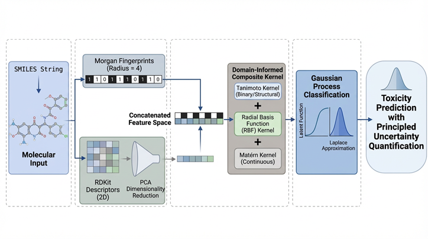

# A Domain-Informed Composite Kernel Gaussian Process Classifier for Molecular Toxicity Prediction with Principled Uncertainty Quantification

### Abstract

Computational toxicity prediction remains a critical bottleneck in drug discovery, where most machine learning models either rely on single-modality molecular representations or lack the principled uncertainty quantification essential for regulatory decision-making. We present the first application of a domain-informed composite kernel Gaussian Process Classifier (Hybrid GPC) to large-scale molecular toxicity prediction, integrating Morgan circular fingerprints and PCA-reduced RDKit physicochemical descriptors through a novel kernel architecture combining Tanimoto, radial basis function, and Matérn components. Trained on one of the largest curated binary toxicity datasets to date (13,949 molecules from Tox21 and T3DB) and evaluated under a scaffold-based splitting strategy that strictly prevents structural data leakage, the model achieved an AUC of 0.8878, accuracy of 0.8292, F1-score of 0.8022, and a Brier score of 0.1350. Systematic ablation across seven kernel configurations confirmed that the composite kernel yields the optimal trade-off between discriminative performance and probability calibration, surpassing both single-kernel Gaussian process baselines and conventional classifiers. Notably, the Hybrid GPC outperformed MolToxPred—the most directly comparable prior study—in both AUC (0.8878 vs. 0.8776) and F1-score (0.8022 vs. 0.7643) despite employing the more stringent scaffold-based evaluation protocol. To our knowledge, this work represents the first integration of heterogeneous molecular kernels within a Gaussian process classification framework for toxicity prediction, delivering competitive performance alongside intrinsic, calibrated uncertainty estimates—a capability absent from existing ensemble and deep learning approaches
